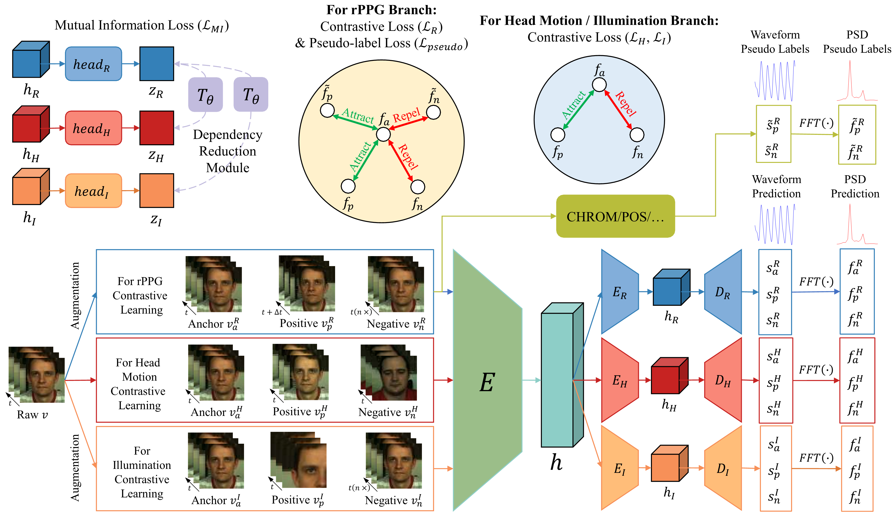

# *rPPG-NDCL*: Unsupervised Remote Physiological Measurement Via Noise-Disentangled Contrastive Learning

Authors: [*Tianyang Dai*](https://ieeexplore.ieee.org/author/182732942234288), [*Yan Chen*](https://ieeexplore.ieee.org/author/37293321400), [*Yang Hu*](https://ieeexplore.ieee.org/author/37535762300).

> Remote photoplethysmography (rPPG) utilizes cameras for noninvasive monitoring of vital signs and has attracted widespread attention. Unsupervised methods have become the primary focus of recent studies due to their advantage of not relying on labeled data. However, these methods lack specialized noise reduction designs and often fail when faced with dynamic noise from complex head motion and illumination variations. To address this issue, we propose a novel noise-disentangling unsupervised framework (rPPG-NDCL). First, we introduce a contrastive learning strategy specific for the signal and noise and incorporate pseudo labels as guidance to separately extract the rPPG signal, head motion and illumination noise. Additionally, we design a dependency reduction module to achieve noise disentangling. Experimental results demonstrate that our method outperforms both the state-of-the-art unsupervised methods and most supervised methods. We also train a robust rPPG estimation model using unlabeled video data not specifically created for rPPG, demonstrating the generalizability of our method to real-world scenarios.

For more details, please refer to our publication: [rPPG-NDCL: Unsupervised Remote Physiological Measurement Via Noise-Disentangled Contrastive Learning](https://ieeexplore.ieee.org/document/11084290).



## Prerequisite

To install required packages, you can install packages with pip by
```bash
pip install -r requirements.txt
```

After preparing required environment, you can clone this repository to use rPPG-NDCL.

## Dataset Preprocessing

1. Download the datasets for preparation: [UBFC-rPPG](https://sites.google.com/view/ybenezeth/ubfcrppg), [PURE](https://www.tu-ilmenau.de/en/university/departments/department-of-computer-science-and-automation/profile/institutes-and-groups/institute-of-computer-and-systems-engineering/group-for-neuroinformatics-and-cognitive-robotics/data-sets-code/pulse-rate-detection-dataset-pure), [BUAA](https://ieeexplore.ieee.org/document/9320298).
2. Use [OpenFace](https://github.com/TadasBaltrusaitis/OpenFace) to extract facial landmarks for each video.
3. Crop facial regions and save data in .h5 format.

```bash
# UBFC-rPPG
python preprocess.py
    --dataset_name "UBFC-rPPG"
    --video_dir "./dataset/UBFC_rPPG/vid/"
    --landmark_dir "./dataset/UBFC_rPPG/lmk/"
    --json_dir "./dataset/UBFC_rPPG/json/"
    --h5_dir "./dataset/UBFC_rPPG/h5/"
    --store_size 128

# PURE
python preprocess.py
    --dataset_name "PURE"
    --video_dir "./dataset/PURE/vid/"
    --landmark_dir "./dataset/PURE/lmk/"
    --json_dir "./dataset/PURE/json/"
    --h5_dir "./dataset/PURE/h5/"
    --store_size 128

# BUAA
python preprocess.py
    --dataset_name "BUAA"
    --video_dir "./dataset/BUAA/vid/"
    --landmark_dir "./dataset/BUAA/lmk/"
    --json_dir "./dataset/BUAA/json/"
    --h5_dir "./dataset/BUAA/h5/"
    --store_size 128
```
where you need to change the `--dataset_name`, `--video_dir`, `--landmark_dir`, `--json_dir`, `--h5_dir`, `--store_size` to your local path.

## Training

Default hyperparameter settings based on single GPU card "NVIDIA Tesla V100".
```bash
# UBFC_rPPG
python main_pretrain.py --config_file configs/pretrain_UBFC_rPPG.yaml

# PURE
python main_pretrain.py --config_file configs/pretrain_PURE.yaml

# BUAA
python main_pretrain.py --config_file configs/pretrain_BUAA.yaml
```

## Testing

Test with your own data:
```bash
# UBFC-rPPG
python main_test.py --config_file configs/test_UBFC_rPPG.yaml

# PURE
python main_test.py --config_file configs/test_PURE.yaml

# BUAA
python main_test.py --config_file configs/test_BUAA.yaml
```

## Results

For your convinience, we provide results on each dataset.

| Dataset   | MAE  | RMSE | R    |
|-----------|------|------|------|
| UBFC-rPPG | 0.42 | 0.58 | 1.00 |
| PURE      | 0.47 | 0.60 | 1.00 |
| BUAA      | 1.66 | 1.92 | 0.99 |

## Citation

If you find this repo useful in your work or research, please cite:
```
@INPROCEEDINGS{11084290,
  author={Dai, Tianyang and Chen, Yan and Hu, Yang},
  booktitle={2025 IEEE International Conference on Image Processing (ICIP)}, 
  title={rPPG-NDCL: Unsupervised Remote Physiological Measurement Via Noise-Disentangled Contrastive Learning}, 
  year={2025},
  volume={},
  number={},
  pages={2856-2861},
  keywords={Head;Noise;Noise reduction;Dynamics;Lighting;Contrastive learning;Photoplethysmography;Noise measurement;Biomedical monitoring;Unsupervised learning;Remote photoplethysmography (rPPG);unsupervised learning;disentangled representation learning;contrastive learning},
  doi={10.1109/ICIP55913.2025.11084290}}
```

## Acknowledgements

This work was supported by the National Natural Science Foundation of China under Grant 62172381.
